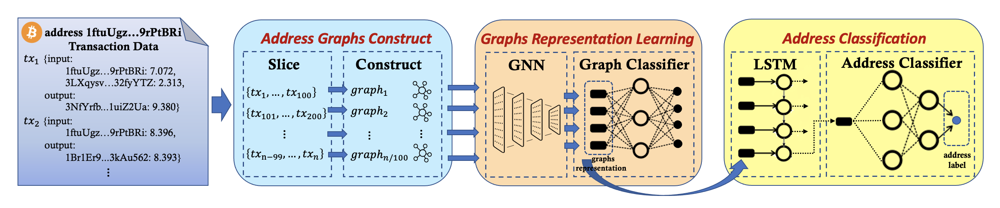

# BAClassifier
This repo is a python implementation of our ***BAClassifier*** for Bitcoin address behavior analyse, which can automatically classify the bitcoin addresses according to the analysis of bitcoin address behaviors. 

## Overview

The high-level pipeline of the proposed ***BAClassifier*** framework  is illustrated in the Figure, which consists of three major modules, namely address graph construction, graph representation learning, and address classification.

- **Address Graph Construction:** Given a set of bitcoin addresses, ***BAClassifier*** constructs the chronological transaction graphs to reflect the behaviors of each address.
- **Graph Representation Learning:** ***BAClassifier*** utilizes graph neural networks to learn the graph representations of each address and generate the graph embeddings.
- **Address Classification:** ***BAClassifier*** aggregates all graph embeddings to produce the address-level representations, and confirms the classification model to output the predictions of address classifications.

## Required Packages
* **Python** 3.6 or above

* **PyTorch**1.4.0

* **pandas** 1.1 or above

* **numpy** 1.19 or above

* **scikit-learn** 0.23 or above

## Dataset
We construct and release a benchmark dataset, which consists of over 2 million bitcoin addresses. We create the dataset by collecting bitcoin addresses from different sources: btc.com, walletexplorer.com, oxt.me, and other websites. Note that all the bitcoin addresses are collected from trusted entities in the field.

We manually label the bitcoin addresses in the dataset, i.e., what transaction behavior is being performed by a bitcoin address. We concern four categories of behaviors, namely exchange, mining, gambling, and service. Our annotations facilitate the evaluation of bitcoin address classification tools extensively.

- **Exchange:** Exchanges hold this type of address, which consists of cold wallet addresses and hot wallet addresses. These addresses are often used by exchanges to manage funds and provide deposit and withdrawal services.

- **Mining:** This type of address is held by the mining pool and the nodes involved in mining. The mining pools receive and distribute mining rewards through this type of address, while the mining nodes receive their reward from the mining pools through this type of address.
- **Gambling:** This type of address is held by gambling websites and gamblers. Gambling websites absorb and manage gambling funds through this class of addresses, while gamblers send and receive gambling funds through this class of addresses.
- **Service:** This type of address is held by websites that provide related services that provide related services, including wallet, coin mixer, dark web, and lending.

The dataset can be found in [dataset directory](https://github.com/AwesomeHuang/BAClassifier/tree/main/dataset).

## Getting started
* To run program of each part, use this command: python main.py.
* Also, you can use specific hyper-parameters to train the model. All the hyper-parameters can be found in `main.py`.

